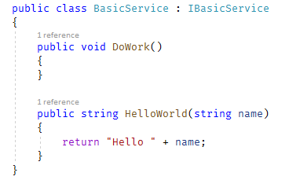
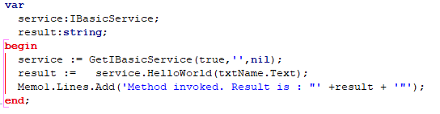
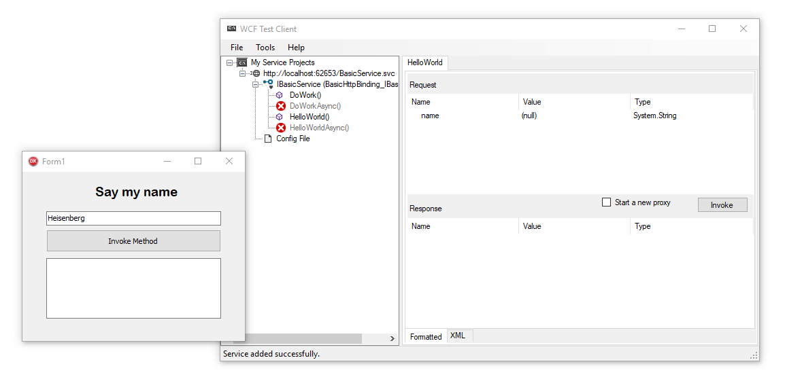
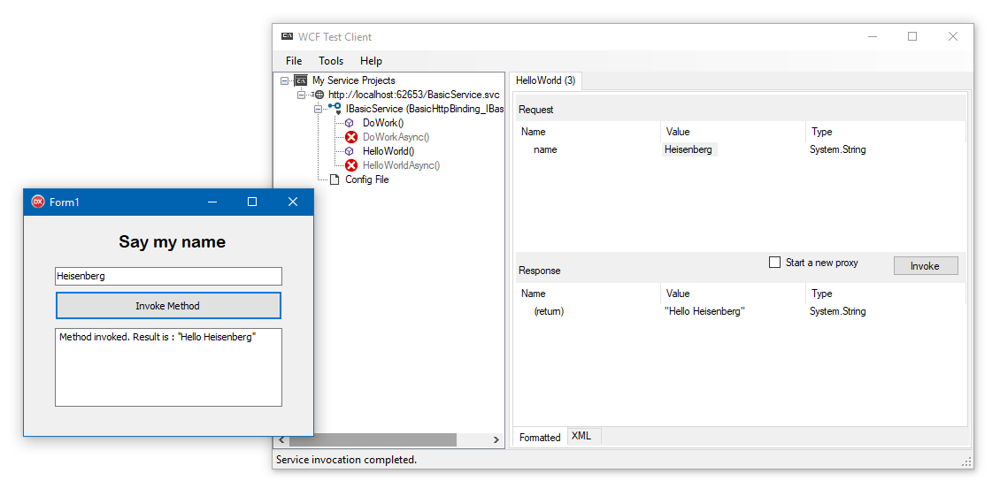

# Using WCF Service in Delphi

## Purpose
 A quick demo for implementing WCF service in Delphi projects.

## Project Structure

|Solution Name|Platform|Purpose|
|---|---|---|
|ProjectZB.Client|Delphi/Pascal|Client device application|
|ProjectZB.Wcf|.Net/C#|IIS Hosted WCF Service|
 
## How to use

### Host Wcf Service in your IIS/IISExpress

To use this sample application, you have to deploy Wcf Service solution to IIS Host. 

If you have already IIS Express in your Visual Studio IDE, you can just run the app. It will execute WCF Test Client application to you. 

### Configure Svc Location in your client app

Just copy the given port number and paste it to `BasicService.pas` `line 63 - (defWSDL property)` under the **ProjectZB.Client** project. 

## Screenshots

**Hello World method in Wcf Service**

**Client Example in Delphi/Pascal**

**Run the client and wcf service.**

**I invoked from our client app and wcf test client app.**

